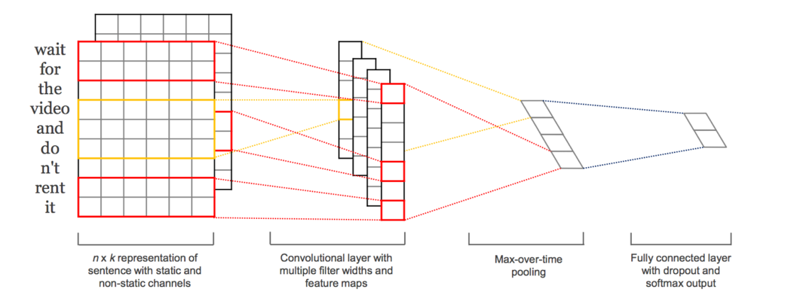
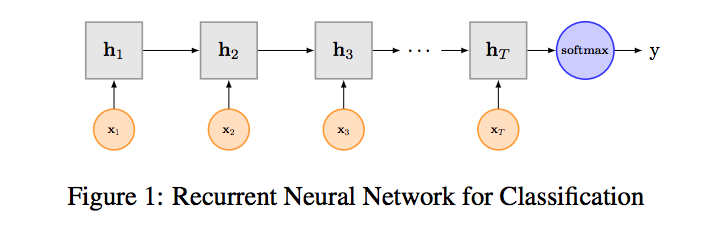
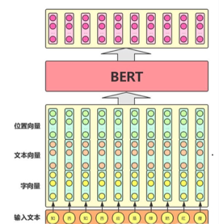
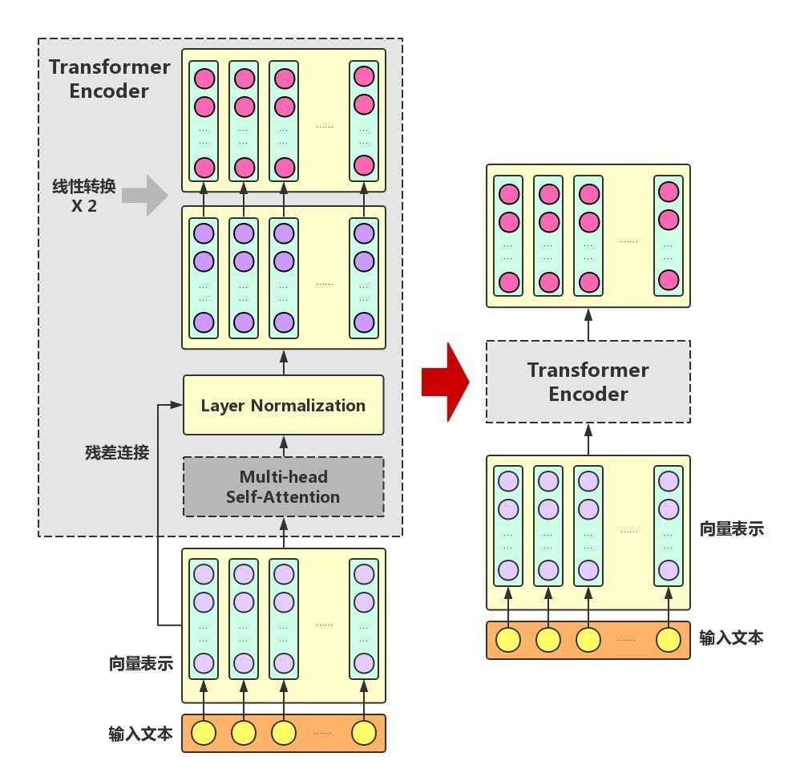

# 文本情感分析报告(sentiment-classification-course-report)

摘要：本文对文本情感分析的方法进行总结，分为了基于情感词典的方法和基于神经网络的方法，并对经典模型进行了简要介绍。对于实际的数据集分类，本文使用了Transformer库的”bert-base-chinese”模型进行训练和预测，获得了较好的情感分类效果。

关键词：文本情感分析；情感分类；深度学习；Transformer

## 一、  研究目的和意义

网络已经逐渐成为现代信息的载体，随着互联网的普及，个人数据爆炸式增长，如新闻评论，文章留言，影视分析，微博等。由普通民众产生的文本信息积聚，成为一项具有实际分析价值的资源。文本情感分析，就是通过对这些主观性文本内容的分析、推理、加工，识别其情感，如高兴、伤心，或者积极、消极、中性等，甚至可以通过长时间地跟踪研究，得出某个人或群体对待特定事物的情感和价值取消的变化趋势。文本情感分析有以下典型的应用场景：

* 用户评论分析与决策

比如商家可以分析用户的消费习惯，更针对性地改进产品；影视公司可以分析观众们对旗下电影的评价，作为电影的评价标准之一。而对于个人，在购买某一产品之前，人们往往倾向于网上查询该产品的相关评论，并通过与其他产品的对比来做最终的决策。由于用户没有足够的时间和精力浏览全部的评论信息， 导致最终的决策带有风险性。情感分析技术则可以很好解决这一难题。该技术首先自动获取大量的相关评论信息，进而挖掘出主要的产品属性(如:“油耗”)和评价词语(如:“高”)，最终通过统计归纳推理，给用户提供该产品各个属性的评价意见，方便用户做最终的决策。

* 舆情监控

越来越多的网民愿意通过互联网表达观点，网络逐渐成为舆情话题产生和传播的主要场所。网络信息和社会信息的交融对社会的直接影响越来越大，甚至关系到国家信息安全和长治久安。因此，社会管理者应及时对这些舆论进行反馈。文本情感分析可以自动化地对舆情话题进行分类，筛查，以达到对不当和恶意言论的监控。

*  信息预测

某一个新事件的发生或者网络上对某个事件的热议都在很大程度上左右着人们的思维和行动。比如在金融市场上，网络上对某支股票的热议都在很大程度上左右着庄家和散户的行为，同时进一步影响着股市变化的趋势。因此，信息预测变得非常必要。情感分析技术可以帮助用户通过对互联网上的新闻、帖子等信息源进行分析，预测某一事件的未来状况。

除了丰富的应用场景，文本情感分析也是一个极具挑战性的NLP研究课题，涉及多项非常有挑战性的研究任务，它在数据挖掘、Web挖掘、信息检索等领域也得到了广泛的研究。[1][2]

## 二、  国内外研究现状

### 1. 基于情感词典的文本情感分析

#### 1.1 基于词典的文本情感分析思路

这种方法的思想非常朴素，即按照一定策略将待分析的文本分词，并将单词与一个机器词典中的词条进行匹配，若在词典中找到某个字符串，则按照词典标记文本。

以知网的情感词库为例，原始字典按照习惯将词汇分为三大类： 

情感词（积极评价词、积极情感词、消极评价词、消极情感词），程度词（从最重的most程度依次降低到least程度，共5个等级）和否定词。基于以上特点，否定词的存在可以用来判别是否进行词汇的极性反转，程度词的存在可以给予不同的情感词不同的分数，而情感词可以整合成积极词和消极词两部分。

 

#### 1.2 文本的分词方法总结

在进行字典匹配之前，我们需要将文本按一定策略分词，本文总结了一些基于机器词典的朴素分词方法。

 

##### 1.2.1 正向最大匹配算法MM

先从左向右取待切分的语句中的m个字符作为匹配字段，m为机器词典中最长词条个数。再查找机器词典并进行匹配。若匹配成功，则将这个匹配字段作为一个词切分出来。若匹配不成功，则将这个匹配字段的最后一个字去掉，剩下的字符串作为新的匹配字段，进行再次匹配，重复以上过程，直到切分出所有词为止。

 

##### 1.2.2 逆向最大匹配算法RMM

该算法是正向最大匹配的逆向（最大匹配的顺序不是从首字母开始，而是从末尾开始），匹配不成功，将匹配字段的最前一个字去掉，实验表明，逆向最大匹配算法要优于正向最大匹配算法。

 

##### 1.2.3 邻近匹配算法

 邻近匹配算法是正向最大匹配算法的改进，因为正向正向最大匹配算法对每个不存在的长字符串都要进行一次二分搜索，算法复杂度太高，可以利用同一个首字符下的词条按升序排列这一条件，在找到某个字符串后，在其后增加一个字得到一个新字串，如果新字串在词典中出现，那么新词一定在原字串的后面，且相隔位置不会太远。这样就可以加快匹配进程。

 

还有其他的改进匹配算法，比如双向最大匹配法(Bi-directction Matching method，BM)，最短路径匹配算法(Shortest path match)等，不在本文中一一列举。他们的思想本质是相同的，但可以提高匹配的效率。

 

#### 1.3 优缺点分析：

优点：这种方法思想简单且准确率高。

缺点：1. 存在召回率比较低的情况。2. 需要人工编写情感词典和机器词典，编写成本和维护成本高昂。3. 在不同领域没有迁移性，需要特定领域专家进行分析编写。

 

### 2. 基于机器学习的方法:

基于机器学习的方法，将文本情感分析作为一个有监督的分类问题。一般会将目标情感分为三类：积极、中性、消极。对训练文本进行人工标注，然后进行有监督的机器学习过程，并对测试数据用模型来预测结果。 

处理过程一般可以分为文本预处理、使用特定的机器学习算法训练、使用模型对新数据预测。

#### 2.1 文本预处理

文本的预处理的目的是文本转换为机器可处理的结构。整体上来说，文本预处理模块包括去噪、特征提取、文本结构化表示等。

##### 2.1.1 特征抽取

中文最小语素是字，但是往往词语才具有更明确的语义信息，但是随着分词，可能出现词语关系丢失的情况。N-gram方法正好解决了这个问题，它也是传统机器学习分类任务中最常用的方法。 下面将简要介绍N-gram模型。

N-gram模型假设第n个词的出现只与前面n-1个词相关，而与其它任何词都不相关。假设句子T是由词序列组成的，那么T出现的概率，可以写成

 但是这种方法会使得参数空间过大和数据稀疏严重。为了解决这个问题，引入了马尔科夫假设：一个词的出现仅仅依赖于它前面出现的有限的一个或者几个词。

 如果一个词的出现仅依赖于它前面出现的一个词，那么我们就称之为bigram。

在实践中用的最多的就是bigram。高于四元的用的很少，因为训练它需要更庞大的语料，而且数据稀疏严重，时间复杂度高，精度却提高的不多。N元模型就是假设当前词的出现概率只同它前面的N-1个词有关。

 

##### 2.1.2 文本向量化

对抽取出来的特征，向量化是一个很重要的过程，是实现由人可以理解的文本转换为计算机可以处理数据的重要一步。这一步最常用到的就是词袋模型（bag-of-words ）以及最近新出的连续分布词向量模型（word Embedding）。词袋模型长度为整个词表的长度，词语对应维度置为词频，文档的表示往往比较稀疏且维度较高。Embedding的表示方式，能够有效的解决数据稀疏且降维到固定维度，更好的表示语义信息。对于文档表示，词袋模型可以直接叠加，而Embedding的方法可以使用深度学习的方法，通过pooling得到最终表示。

 

##### 2.1.3 特征选择

在机器学习分类算法的使用过程中，特征好坏直接影响机器的准确率及召回率。选择有利于分类的特征，可以有效的减少训练开支及防止模型过拟合，尤其是数据量较大的情况下，这一部分工作的重要性更加明显。将所有的训练语料输入选择最有效的特征，主要的方法有信息熵，dp深层感知器等等。

 

#### 2.2 分类算法的选择

文本转换为机器可处理的结构后，接下来便要选择进行机器学习的分类算法。使用率比较高的是深度学习（CNN，RNN）和支持向量机（SVM）。深度学习的方法，运算量大，但准确率较高。而支持向量机则是比较传统的方法，其准确率及数据处理能力也比较出色，很多人都在用它来做分类任务。

 

##### 2.2.1 基于SVM的分类算法

SVM(Support Vector Machine)，中文名为支持向量机，是 Vapnik 等人在对线性分类器提出了另一种设计最佳准则。

对于线性可分的数据，可以画出特点一条直线直接将元组分开。对于非线性不可分的数据，SVM 使用一种非线性映射，将原训练数据映射到较高的维。从 而使得高维特征空间采用线性算法对样本的非线性特征进行线性分析成为可 能。在新的高维空间上，SVM 会基于结构风险最小化理论搜索线性最佳分离超 平面，即将一类元组与其他类分离的决策边界。SVM 使用支持向量(即基本训 练元组)和边缘(由支持向量定义)发现该超平面。SVM 的学习可以表示为凸优化问题，因此能利用已知的有效算法发现目标 函数的全局最小值。而其他分类方法，如基于规则的分类器和人工神经网络，大多采用一种基于贪心学习的策略来搜索假设空间，一般只能获得局部最优解。SVM不仅可以解决两类问题，而且可以处理多分类问题。经典的支持向量机算法只给出了二类分类的算法，而在数据挖掘的实际应用中，一般要解决多类的分类问题。可以通过多个二类支持向量机的组合来解决。主要有一对多组合模式、一对一组合模式和SVM决策树；再就是通过构造多个分类器的组合来解决。主要原理是克服SVM固有的缺点，结合其他算法的优势，解决多类问题的分类精度。如：与粗集理论结合，形成一种优势互补的多类问题的组合分类器。[3]

* 优点：

(1)SVM 是一种有坚实理论基础的新颖的小样本学习方法。它基本上不涉及概率测度及大数定律等,因此不同于现有的统计方法。从本质上看,它避开了从归纳到演绎的传统过程,实现了高效的从训练样本到预报样本的“转导推理”,大大简化了通常的分类和回归等问题。

(2)SVM 的最终决策函数只由少数的支持向量所确定,计算的复杂性取决于支持向量的数目,而不是样本空间的维数,这在某种意义上避免了“维数灾难”。

(3)少数支持向量决定了最终结果,这不但可以帮助我们抓住关键样本、“剔除”大量冗余样本,而且注定了该方法不但算法简单,而且具有较好的鲁棒性。

* 缺点：SVM算法对大规模训练样本难以实施

##### 2.2.2 基于深度学习的分类算法

可以处理分类问题的深度学习模型种类繁多，比如fastText、TextCNN、TextRNN、分层注意网络（Hierarchical Attention Network）、具有注意的seq2seq模型（seq2seq with attention）、Transformer、动态记忆网络（Dynamic Memory Network）等等，本文主要介绍经典的TextCNN，TextRNN模型。

* TextCNN

最初在图像领域取得了巨大成功，CNN可以捕捉局部相关性，具体到文本分类任务中可以利用CNN来提取句子中类似 n-gram 的关键信息。[4] 

以下图的TextCNN结构的详细过程原理图为例[5] ：

TextCNN详细过程：第一层是图中最左边的7乘5的句子矩阵，每行是词向量，维度=5，这个可以类比为图像中的原始像素点了。然后经过有 filter_size=(2,3,4) 的一维卷积层，每个filter_size 有两个输出 channel。第三层是一个1-max pooling层，这样不同长度句子经过pooling层之后都能变成定长的表示了，最后接一层全连接的 softmax 层，输出每个类别的概率。

* TextRNN

尽管TextCNN能够在很多任务里面能有不错的表现，但CNN的问题是固定 filter_size 的视野，一方面无法建模更长的序列信息，另一方面 filter_size 的超参调节也很繁琐。CNN本质是做文本的特征表达工作，而自然语言处理中更常用的是递归神经网络（RNN, Recurrent Neural Network），能够更好的表达上下文信息。具体在文本分类任务中，Bi-directional RNN（实际使用的是双向LSTM）从某种意义上可以理解为可以捕获变长且双向的的 "n-gram" 信息。

TextRNN有很多结构，下图LSTM用于网络结构原理示意图[6]，示例中的是利用最后一个词的结果直接接全连接层softmax输出。

## 三、  研究方法

本文基于Pytorch版本的Transformer库，使用了bert模型进行文本情感分类，采用了与训练模型"bert-base-chinese"，并使用dropout防止过拟合问题。最终的参数：学习率2e-5，训练轮数12轮，dropout=0.5，截断truncation=True，max_length=256。 

接下来，对bert模型进行简单介绍。

###  1．bert的输入和输出

bert（Bidirectional Encoder Representations from Transformers）使用的是Transformer架构[7]，其最大的特点是抛弃了传统的RNN和CNN，通过Attention机制将任意位置的两个单词的距离转换成1，有效的解决了NLP中棘手的长期依赖问题。

BERT模型的目标是利用大规模无标注语料训练、获得文本的包含丰富语义信息的Representation，即：文本的语义表示，然后将文本的语义表示在特定NLP任务中作微调，最终应用于该NLP任务。模型输入除了字向量，还包含另外两个部分：

* 文本向量：该向量的取值在模型训练过程中自动学习，用于刻画文本的全局语义信息，并与单字/词的语义信息相融合

* 位置向量：由于出现在文本不同位置的字/词所携带的语义信息存在差异（比如：“我爱你”和“你爱我”），因此，BERT模型对不同位置的字/词分别附加一个不同的向量以作区分。

最后，BERT模型将字向量、文本向量和位置向量的加和作为模型输入。特别地，在目前的BERT模型中，文章作者还将英文词汇作进一步切割，划分为更细粒度的语义单位（WordPiece），例如：将playing分割为play和##ing；此外，对于中文，目前作者尚未对输入文本进行分词，而是直接将单字作为构成文本的基本单位。模型输出则是输入各字对应的融合全文语义信息后的向量表示。对于不同的NLP任务，模型输入会有微调，对模型输出的利用也有差异。

### 2．模型结构

了解了bert模型的输入/输出和预训练过程之后，我们来看一下bert模型的内部结构。前面提到过，BERT模型的全称是：Bidirectional Encoder Representations from Transformer，也就是说，Transformer是组成BERT的核心模块，而Attention机制又是Transformer中最关键的部分。利用Attention机制构建Transformer模块，在此基础上，用多层Transformer组装BERT模型。

## 四、  实验结果和分析

由于bert模型对输入样本长度的限制，训练过程中都需要进行截断操作。

第一次采用512词截断，训练了12轮，学习率为2e-5，在dev集准确率acc=0.822

在test集的结果如下：

| F1(macro)   | accuracy    | precision | recall    |
| ----------- | ----------- | --------- | --------- |
| 0.813570815 | 0.850666667 | 0.8167606 | 0.8106913 |

 

第二次采用256词截断，训练了25轮，学习率为2e-5，在dev集准确率acc=0.819

在test集的结果如下：

| F1(macro)  | accuracy | precision  | recall     |
| ---------- | -------- | ---------- | ---------- |
| 0.78718111 | 0.838    | 0.80530102 | 0.77779029 |

 

可以看出，各指标都有下降。尽管更早截断可以提升训练速度，有更多的训练轮次，但是损失了更多信息，导致模型效果下降。

## 五、   结论

文本情感分析是一个随着互联网发展而出现的研究方向，在用户评论分析与决策，舆情监控，信息预测等方面具有很强的现实意义。文本情感分析的方法可以分为基于情感词典的方法和基于神经网络的方法。

本文通过使用Bert模型对实际的文本数据集进行训练，在文本情感分类中获得了较好的效果。

## 六、  参考文献

1. Zhang L, Wang S, Liu B. Deep Learning for Sentiment Analysis : A Survey[J].2018

2. 周立柱，贺宇凯，王建勇，情感分析研究综述，计算机应用（Computer Application），2008.11

3. Chih-Wei Hsu and Chih-Jen Lin，A Comparison of Methods for Multiclass Support Vector Machines ，IEEE TRANSACTIONS ON NEURAL NETWORKS, VOL. 13, NO. 2, MARCH 2002 

4. Vieira, João Paulo Albuquerque Moura, Raimundo Santos,An analysis of convolutional neural networks for sentence classification, 2017 43rd Latin American Computer Conference, CLEI 2017

5. Kalchbrenner, Nal Grefenstette, Edward Blunsom, Phil,A convolutional neural network for modelling sentences, 52nd Annual Meeting of the Association for Computational Linguistics, ACL 2014 - Proceedings of the Conference,2014

6. Liu Pengfei,Qiu Xipeng, Xuanjing Huang,Recurrent neural network for text classification with multi-task learning, IJCAI International Joint Conference on Artificial Intelligence, 2016

7. Ashish Vaswani, Noam Shazeer, Niki Parmar, Jakob Uszkoreit, Llion Jones, Aidan N. Gomez, Lukasz Kaiser, Illia Polosukhin，Attention Is All You Need，Computation and Language (cs.CL); Machine Learning (cs.LG)，12 Jun 2017

 