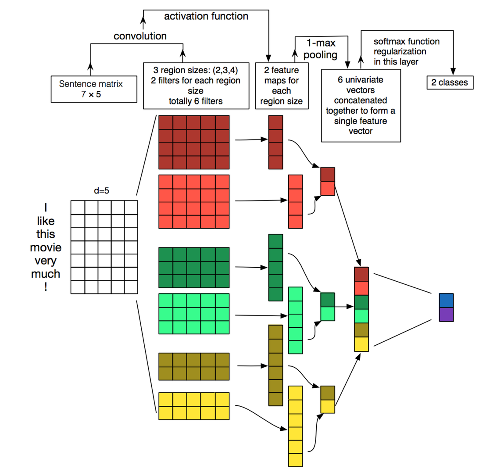

# Sentiment-Classification-Course-Report

### Table of contents

- [Abstract](#abstract)

- [1. Purpose and significance of the study](#1-purpose-and-significance-of-the-study)

- [2. Current status of domestic and international research](#2-current-status-of-domestic-and-international-research)
  - [2.1 Text sentiment analysis based on sentiment dictionary](#21-text-sentiment-analysis-based-on-sentiment-dictionary)
    - [2.1.1 Lexicon-based text sentiment analysis](#211-lexicon-based-text-sentiment-analysis)
    - [2.1.2 Summary of word division methods for text](#212-summary-of-word-division-methods-for-text)
      - [2.1.2.1 Forward maximum matching algorithm MM](#2121-forward-maximum-matching-algorithm-mm)
      - [2.1.2.2 Reverse Maximum Matching Algorithm RMM](#2122-reverse-maximum-matching-algorithm-rmm)
      - [2.1.2.3 Neighborhood Matching Algorithm](#2123-neighborhood-matching-algorithm)
    - [2.1.3 Advantages and disadvantages analysis](#213-advantages-and-disadvantages-analysis)
  - [2.2 Machine learning based approach](#22-machine-learning-based-approach)
    - [2.2.1 Text preprocessing](#221-text-preprocessing)
      - [2.2.1.1 Feature Extraction](#2211-feature-extraction)
      - [2.2.1.2 Text vectorization](#2212-text-vectorization)
      - [2.2.1.3 Feature selection](#2213-feature-selection)
    - [2.2.2 Selection of classification algorithms](#222-selection-of-classification-algorithms)
      - [2.2.2.1 SVM-based classification algorithm](#2221-svm-based-classification-algorithm)
      - [2.2.2.2 Deep learning based classification algorithm](#2222-deep-learning-based-classification-algorithm)
  
- [3. Research Methodology](#3-research-methodology)
  - [3.1 BERT's input and output](#31-berts-input-and-output)
  - [3.2 Model structure](#32-model-structure)
  
- [4. Experimental results and analysis](#4-experimental-results-and-analysis)

- [5. Conclusion](#5-conclusion)

- [6.  References](#6--references)

  

## Abstract

In this paper, we first provided a summary of text sentiment analysis methods which are divided into sentiment lexicon based methods and neural network based methods, and a brief introduction of classical models. Then we used the `bert-base-chines` model of Transformer library for training and prediction, which achieved good sentiment classification results.

**Keywords**: text sentiment analysis; sentiment classification; deep learning; Transformer.

## 1. Purpose and significance of the study

The Internet has gradually become the carrier of modern information. With the popularization of the Internet, personal data has exploded, such as news comments, article messages, film and television analysis, microblogs, etc. The text information generated by the general public has accumulated. and become a valuable resource for practical analysis. Text sentiment analysis is to analyze, reason, and process these subjective text contents to identify their emotions, such as happy, sad, or positive, negative, neutral, etc. It can even be used in long time tracking studies to derive the trend of emotion and value orientation of a certain person or group towards a specific subject. Text sentiment analysis has the following typical application scenarios.

* **User comment analysis and decision making**

  For example, businesses can analyze users' consumption habits to improve their products; movie companies can analyze audience's comments on their movies as one of the evaluation criteria for movies. For individuals, before buying a product, people tend to check the reviews of the product online and make a final decision by comparing it with other products. Since users do not have enough time and energy to browse through all the reviews, the final decision could be risky. Sentiment analysis technology could help user's decision making process by automatically obtaining a large number of related reviews, digging out the main product attributes (e.g. "fuel consumption") and evaluation keywords (e.g. "high"), and finally providing users with the evaluation opinions of each attribute of the product through statistical induction and reasoning.

* **Public opinion monitoring**

  More and more Internet users are willing to express their opinions through the Internet, and the Internet has gradually become the main place for the generation and dissemination of public opinion topics. The intermingling of network information and social information has an increasing direct impact on society and even relates to a country's information security and long-term stability. Therefore, social managers should monitor public opinions and provide timely feedback. Text sentiment analysis can automate the classification of public opinion topics and screen them to achieve monitoring of inappropriate and malicious speech.

* **Information Prediction**

  The occurrence of a new event or the buzz on the Internet about a certain event largely influences people's thinking and actions. For example, in the financial market, the buzz about a certain stock on the Internet largely influences the behavior of bankers and retail investors, and further influences the trend of stock market changes. Therefore, information prediction becomes very necessary. Sentiment analysis technology can help users predict the future status of an event by analyzing news, posts and other information sources on the Internet.

In addition to rich application scenarios, text sentiment analysis is also a challenging NLP research topic which involves several challenging research tasks. It has also been extensively studied in the fields of data mining, Web mining, and information retrieval. [[1]](# 6.  References) [[2]](# 6.  References)

## 2. Current status of domestic and international research

### 2.1 Text sentiment analysis based on sentiment dictionary

#### 2.1.1 Lexicon-based text sentiment analysis

The idea of this method is very simple, that is, the text to be analyzed is divided into words according to a certain strategy, and the words are matched with entries in a machine dictionary, and if a certain string is found in the dictionary, the text is labeled accordingly.

In the case of the sentiment lexicon of Zhiwang, for example, the original dictionary divided words into three main categories by convention.

Affective words (positive evaluation words, positive emotion words, negative evaluation words, negative emotion words), degree words (from the heaviest degree of most to the degree of least in descending order, with 5 levels) and negation words. Based on the above features, the presence of negation words can be used to discriminate whether to perform lexical polarity reversal, the presence of degree words can give different scores to different emotion words, and emotion words can be integrated into two parts: positive words and negative words.

 

#### 2.1.2 Summary of word division methods for text

Before dictionary matching, we need to divide the text into words according to certain strategies, and this paper summarizes some word division methods based on machine dictionaries.

##### 2.1.2.1 Forward maximum matching algorithm MM

First, we take m characters of the statement to be cut from left to right as the matching field, with m being the number of longest words in the machine dictionary. Then we look up the machine dictionary to perform a match. If the match is successful, this matching field is cut out as a word. If the match is unsuccessful, the last word of this matching field is removed, and the remaining string is used as a new matching field for matching again. The above process is repeated until all words are cut out.

##### 2.1.2.2 Reverse Maximum Matching Algorithm RMM

This algorithm is the reverse of forward maximal matching (the order of maximal matching does not start from the first letter, but from the end). If the matching is unsuccessful, the top word of the matching field is removed. The experiment shows that the reverse maximal matching algorithm is better than the forward maximal matching algorithm.

##### 2.1.2.3 Neighborhood Matching Algorithm

The neighbor matching algorithm is an improvement of the forward max matching algorithm. The forward max matching algorithm performs a dichotomous search for each long string that does not exist, resulting in a high complexity of the algorithm. It can be improved by using the condition that the words under the same initial character are arranged in ascending order. After finding a certain string, a word is added after it to get a new string. If the new string appears in the dictionary, the new word must be after the original string and not too far apart. This will speed up the matching process.

 

There are other improved matching algorithms, such as Bi-directive Matching method (BM), Shortest path match, etc., which are not listed in this paper. All of them can improve the efficiency of matching.

 

#### 2.1.3 Advantages and disadvantages analysis

Pros: This method is simple in theory and has a high accuracy rate.

Disadvantages: 1. there is a relatively low recall rate. 2. it requires manual writing of sentiment dictionaries and machine dictionaries, which is costly to write and maintain. 3. there is no migration in different domains and requires domain-specific experts for analysis and writing.

 

### 2.2 Machine learning based approach

The machine learning based approach treats text sentiment analysis as a supervised classification problem. The target sentiment is generally classified into three categories: positive, neutral, and negative. The training text is manually annotated, and then a supervised machine learning process is performed and the test data is used to predict the results with a model.

The process can generally be divided into text pre-processing, training using specific machine learning algorithms, and prediction using models on new data.

#### 2.2.1 Text preprocessing

The purpose of text preprocessing is to convert of text into a machine-processable structure. Overall, the text preprocessing module includes denoising, feature extraction, and structured representation of text.

##### 2.2.1.1 Feature Extraction

The smallest semantic element in Chinese is the word, but it is often the word that has more explicit semantic information. With word separation, word relationships may be lost. The N-gram method solves exactly this problem, and it is one of the most commonly used method in traditional machine learning classification tasks. The N-gram model is briefly described below.

The N-gram model assumes that the occurrence of the nth word is only related to the previous n-1 words and not to any other words. Assuming that the sentence T is composed of a sequence of words $W_1,W_2,...,W_n$, the probability of occurrence of T, which can be written as
$$
P(T)=P(W_1W_2...W_n)=P(W_1)P(W_2|W_1)...P(W_n|W_1W_2...W_{n-1})
$$
But this approach would make the parameter space too large and the data sparse severely. To solve this problem, the Markov assumption is introduced: the occurrence of a word depends only on a finite number of words or words that occur before it.

 

If the occurrence of a word depends on only one word preceding it, then we call it a bigram.
$$
P(T)=P(W_1W_2...W_n)=P(W_1)P(W_2|W_1)...P(W_n|W_1W_2...W_{n-1})\\
\approx P(W_1)P(W_2|W_1)P(W_3|W_2)...P(W_n|W_{n-1})
$$
In practice, the bigram is the most used, but the one above quadratic is rarely used, because it requires a much larger corpus to train, and the data sparsity is severe, the time complexity is high, and the accuracy is not improved much. n-word model assumes that the occurrence probability of the current word is only related to the N-1 words before it. 

##### 2.2.1.2 Text vectorization

The quantization of the extracted features is an important step in converting human-understandable text into computer-processable data. This step is most commonly used in the bag-of-words model and the recently introduced continuous distribution word vector model (word Embedding). The length of the bag-of-words model is the length of the entire word list, and the corresponding dimension of the words is set to the word frequency. The representation of documents is often sparse and high-dimensional. The Embedding representation can effectively solve the sparse data and reduce the dimensionality to a fixed dimension, and better represent the semantic information. For document representation, bag-of-words model can be directly overlaid, while Embedding approach can use deep learning methods to get the final representation by pooling.

##### 2.2.1.3 Feature selection

In the process of using machine learning classification algorithms, whether features are good or bad directly affects the accuracy and recall rate of the algorithm. Selecting features that are good for classification can effectively reduce training expenses and prevent model overfitting, especially when the data volume is large, the importance of this part of the work is more obvious. The main methods to select the most effective features from all training corpus inputs are information entropy, dp deep perceptron, etc.

 

#### 2.2.2 Selection of classification algorithms

After the text is converted into a machine-processable structure, the next step is to select a classification algorithm for machine learning. The most used ones are deep learning (CNN, RNN) and support vector machines (SVM). The deep learning approach is more computationally intensive, but more accurate. Support vector machine, on the other hand, is a more traditional method, with better accuracy and data processing capability. 

##### 2.2.2.1 SVM-based classification algorithm

SVM (Support Vector Machine), is an alternative design best criterion for linear classifiers proposed by Vapnik et al.

For linearly separable data, a straight line can be drawn to separate the components directly. For nonlinearly indistinguishable data, SVM uses a nonlinear mapping that maps the original training data to a higher dimension. This makes it possible to perform linear analysis of the nonlinear features of the samples using linear algorithms in the high-dimensional feature space. The SVM finds this hyperplane using support vectors (i.e., the basic training tuples) and edges (defined by support vectors). The minimum value. Other classification methods, such as rule-based classifiers and artificial neural networks, mostly use a greedy learning-based strategy to search the hypothesis space and generally only obtain locally optimal solutions. SVM can not only solve two types of problems, but can also handle multi-classification problems. The classical support vector machine algorithm only gives algorithms for two-class classification, while in practical applications of data mining, multi-class classification problems are generally to be solved. It can be solved by the combination of multiple two-class support vector machines. There are mainly one-to-many combinatorial models, one-to-one combinatorial models and SVM decision trees; then it is solved by constructing combinations of multiple classifiers. The main principle is to overcome the inherent shortcomings of SVM and combine the advantages of other algorithms to solve the classification accuracy of multi-class problems. For example, it is combined with rough set theory to form a combined classifier for multi-class problems with complementary advantages. [[3]](# 6.  References)

* **Advantages**

  (1) SVM is a novel small sample learning method with a solid theoretical foundation. It is different from existing statistical methods because it basically does not involve probability measures and the law of large numbers. In essence, it avoids the traditional process from induction to deduction, and achieves efficient "transductive inference" from training samples to forecast samples, which greatly simplifies the usual problems of classification and regression.

  (2) The final decision function of SVM is determined by only a small number of support vectors, and the complexity of the computation depends on the number of support vectors rather than the dimensionality of the sample space, which avoids the "dimensionality disaster" to some extent.

  (3) A small number of support vectors determines the final result, which not only helps us to catch the key samples and "eliminate" a large number of redundant samples, but also predestines the method to be not only simple, but also has good robustness.

* **Disadvantages**

  SVM algorithm is difficult to implement for large-scale training samples

##### 2.2.2.2 Deep learning based classification algorithm

There are many kinds of deep learning models that can deal with classification problems, such as fastText, TextCNN, TextRNN, Hierarchical Attention Network, seq2seq with attention, Transformer, Dynamic Memory Network, etc. In this paper, we mainly introduce the classical TextCNN and TextRNN models.

* **TextCNN**

TextCNN is initially a great success in the image field. It can capture local relevance, specifically for text classification tasks can be used to extract key n-gram-like information in sentences. [[4]](# 6.  References) 

The detailed process of TextCNN structure is illustrated in the following schematic diagram [[5]](# 6.  References).

Textcnn detailed process: the first layer is the leftmost sentence matrix of 7 times 5, each line is a word vector, dimension = 5, which can be compared to the original pixel in the image. And then through the filter_ Size = (2,3,4) for each filter_ Size has two output channels. The third layer is a 1-max pooling layer, so that sentences of different lengths can become fixed length representations after passing through the pooling layer. Finally, a fully connected softmax layer is connected to output the probability of each category.

* **TextRNN**

Although TextCNN can perform well in many tasks, the problem of CNN is the vision of fixed filter_size, which cannot model longer sequence information on the one hand, and the superparameter adjustment of filter_size is tedious on the other hand. In natural language processing, recurrent neural networks (RNN, Recurrent Neural Network) are more commonly used, which can better represent contextual information. Specifically in text classification tasks, Bi-directional RNNs (actually using bi-directional LSTMs) can be understood in a sense to capture variable length and bi-directional "n-gram" information.

There are many structures of TextRNN. The following figure LSTM is used for the schematic of network structure [[6]](# 6.  References), which is using the result of the last word directly connected to the fully connected layer softmax output.

## 3. Research Methodology

This paper uses a bert model for text sentiment classification based on the Pytorch version of the Transformer library, the same training model "bert-base-chinese", and dropout to prevent overfitting problems. The final parameters: learning rate 2e-5, number of training rounds 12, dropout=0.5, truncation=True, max_length=256.

Next, a brief introduction of the bert model is given.

###  3.1 BERT's input and output

BERT (Bidirectional Encoder Representations from Transformers) uses the Transformer architecture [[7]](# 6.  References), whose biggest feature is that it discards the traditional RNN and CNN and converts the distance of two words at any position to 1 through the Attention mechanism, which effectively solves the tricky long-term dependency problem in NLP.

The goal of the BERT model is to use a large-scale unlabeled corpus to train and obtain a representation of the text containing rich semantic information, i.e., the semantic representation of the text, and then fine-tune the semantic representation of the text in a specific NLP task and finally apply it to that NLP task. The model input contains two other components in addition to the word vector.

* **Text vector**: the values of this vector are automatically learned during the model training process and are used to portray the global semantic information of the text and fuse it with the semantic information of single words/words.

* **Position vector**: Since there is a difference in the semantic information carried by words/words appearing in different positions of the text (e.g., "I love you" and "you love me"), the BERT model appends a different vector to the words/words in different positions to differentiate them.

Finally, the BERT model takes the sum of the word vector, text vector and position vector as model inputs. In particular, in the current BERT model, the authors further cut the English vocabulary into finer-grained semantic units (WordPieces), e.g., splitting playing into playing and ##ing; in addition, for Chinese, the authors have not yet split the input text into words, but directly use a single word as the basic unit of the text. The model output is then a vector representation of the fused full-text semantic information corresponding to each word of the input. For different NLP tasks, the model inputs are fine-tuned and the utilization of the model outputs varies.

### 3.2 Model structure

After understanding the input/output and pre-training process of the BERT model, let us look at the internal structure of the BERT model. As mentioned earlier, the full name of the BERT model is: Bidirectional Encoder Representations from Transformer, which means that the Transformer is the core module of BERT. The Attention mechanism is the most critical part of the Transformer. The Transformer module is constructed using the Attention mechanism, and on this basis, the BERT model is assembled using a multi-layer Transformer.

## 4. Experimental results and analysis

Due to the limitation of the bert model on the length of input samples, truncation operations are required during the training process.

The first time 512-word truncation was used, 12 rounds were trained with a learning rate of 2e-5, and the accuracy in the dev set acc=0.822.

The results on the test set are as follows.

| F1(macro)   | accuracy    | precision | recall    |
| ----------- | ----------- | --------- | --------- |
| 0.813570815 | 0.850666667 | 0.8167606 | 0.8106913 |

 The second time using 256-word truncation, 25 rounds were trained with a learning rate of 2e-5, and the accuracy in the dev set acc=0.819.

The results on the test set are as follows.

| F1(macro)  | accuracy | precision  | recall     |
| ---------- | -------- | ---------- | ---------- |
| 0.78718111 | 0.838    | 0.80530102 | 0.77779029 |

 

It can be seen that there is a decrease in all metrics. Although earlier truncation can improve the training speed and have more training rounds, more information is lost, which leads to a decrease in model effectiveness.

## 5. Conclusion

Text sentiment analysis is a research direction that emerged with the development of the Internet and has strong practical significance in user comment analysis and decision making, opinion monitoring, and information prediction. The methods of text sentiment analysis can be divided into methods based on sentiment dictionaries and methods based on neural networks.

In this paper, we obtained better results in text sentiment classification by using Bert model to train on actual text dataset.

## 6.  References

1. Zhang L, Wang S, Liu B. Deep Learning for Sentiment Analysis : A Survey[J].2018

2. 周立柱，贺宇凯，王建勇，情感分析研究综述，计算机应用（Computer Application），2008.11

3. Chih-Wei Hsu and Chih-Jen Lin，A Comparison of Methods for Multiclass Support Vector Machines ，IEEE TRANSACTIONS ON NEURAL NETWORKS, VOL. 13, NO. 2, MARCH 2002 

4. Vieira, João Paulo Albuquerque Moura, Raimundo Santos,An analysis of convolutional neural networks for sentence classification, 2017 43rd Latin American Computer Conference, CLEI 2017

5. Kalchbrenner, Nal Grefenstette, Edward Blunsom, Phil,A convolutional neural network for modelling sentences, 52nd Annual Meeting of the Association for Computational Linguistics, ACL 2014 - Proceedings of the Conference,2014

6. Liu Pengfei,Qiu Xipeng, Xuanjing Huang,Recurrent neural network for text classification with multi-task learning, IJCAI International Joint Conference on Artificial Intelligence, 2016

7. Ashish Vaswani, Noam Shazeer, Niki Parmar, Jakob Uszkoreit, Llion Jones, Aidan N. Gomez, Lukasz Kaiser, Illia Polosukhin，Attention Is All You Need，Computation and Language (cs.CL); Machine Learning (cs.LG)，12 Jun 2017

 